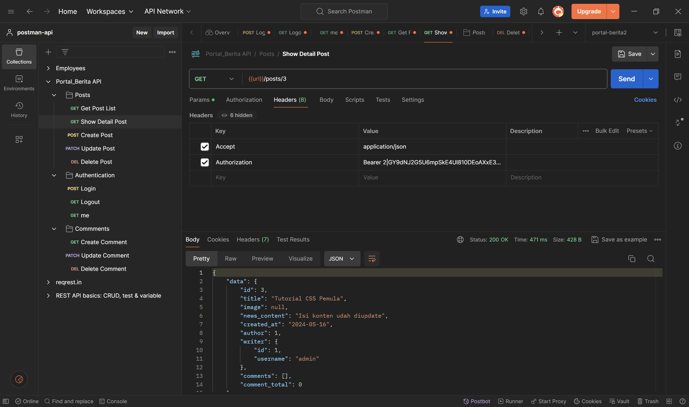

# Portal Berita
Sebuah backend untuk website berita nantinya yang menampilkan beberapa berita yang bisa ditampilkan, komentari, dibuat, beserta diupdate yang dikelola menggunakan metode restful api

## Daftar Isi
- [Tumpukan Teknologi](#tumpukan-teknologi)
- [Fitur](#fitur)
- [Dokumentasi Halaman](#dokumentasi-halaman)
- [Cara Instalasi](#cara-instalasi)
- [Cara Penggunaan](#cara-penggunaan)

## Tumpukan Teknologi
### Backend
- **Laravel 11**: Kerangka kerja PHP untuk pengembangan web yang elegan dan ekspresif

### API
- **Restful API**: Gaya arsitektur untuk merancang layanan web yang berkomunikasi melalui protokol HTTP. RESTful API menggunakan operasi HTTP standar seperti GET, POST, PUT, DELETE untuk melakukan berbagai tindakan pada sumber daya yang diidentifikasi oleh URL.

### DBMS
- **MySQL**: Sistem manajemen basis data relasional open-source

## Fitur
- **User**: pengguna dapat membuat, mengubah,dan menghapus pengguna untuk mengelola berita nantinya
- **Autentikasi**: pengguna juga dapat registrasi dan login pengguna untuk masuk atau memnbuat berita
- **Postingan Berita**: penggguna dapat mengganti password penggunannya apabila lupa dengan mengirimnya ke email pengguna
- **Komentar Berita**: pengguna dapat memberi komentar pada berita yang dibuat oleh diri sendiri maupun orang lain

## Dokumentasi Halaman
##### 1. Percobaan untuk menampilkan seluruh data postingan berita


## Cara Instalasi
```bash
# Clone repository ini
git clone https://github.com/defrijay/portal-berita.git

# Buka direktorinya
cd portal-berita

# Nyalakan apache dan mysql modulenya di XAMPP

# Import databasenya di phpmyadmin
db_portal.sql

# Panggil dengan command artisan untuk memanggil servernya
php artisan serve

# Buka servernya
http://127.0.0.1:8000/

# Import collections Restful API nya
Portal_Berita API.postman_collection

# Ujicoba dengan untuk restful apinya dengan postman

```

## Cara Penggunaan
1. Sebelum mencobanya dengan postman pastikan login terlebih dahulu dengan email `admin@gmail.com` dan password `rahasia`.
2. Masukkan url utama berikut 
`http://127.0.0.1:8000/api/`
3. Selanjutnya maka url dapat digunakan untuk pengetesan create, read, update, dan delete data dengan metode `GET`, `POST`, `PATCH`, dan `DELETE` untuk melakukan crud postingan maupun komentarnya


